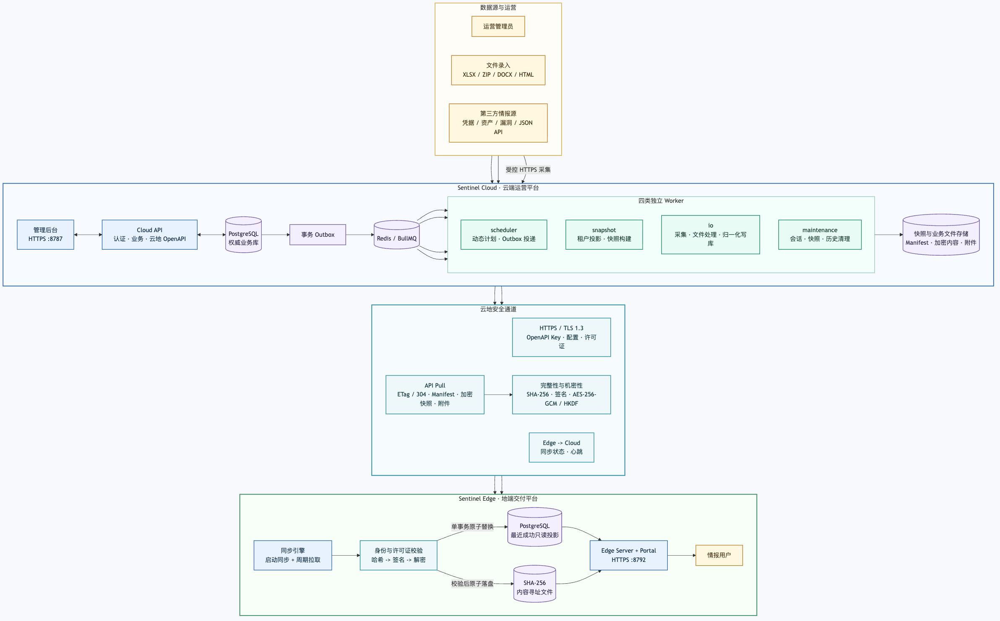

# Sentinel Cloud 生产包

`sentinel-cloud` 是 Sentinel 威胁情报平台的云端运营生产包。它负责租户与账号管理、监测对象和数据源配置、情报录入与审核、第三方采集、任务调度、地端部署管理，以及面向地端发布签名加密快照。

本包只包含云端组件，不包含地端 Portal 和 Edge Server。地端部署使用同级目录中的 `release/sentinel-edge` 生产包。

## 包内组件

| 目录或服务 | 职责 |
| --- | --- |
| `apps/admin-web` | React 运营管理后台和租户 Portal 预览，生产构建后由 Cloud API 同源托管 |
| `apps/api-server` | Node.js HTTPS API、认证授权、业务服务、云地协议与数据库迁移 |
| `worker-scheduler` | 同步 PostgreSQL 中的动态计划，扫描事务 Outbox 并向 BullMQ 投递任务 |
| `worker-snapshot` | 按租户和部署构建、签名、加密并发布地端完整快照 |
| `worker-io` | 执行第三方连接器采集和外部 I/O 任务 |
| `worker-maintenance` | 清理过期会话、快照残留、任务历史和队列历史 |
| `cloud-postgres` | 权威业务数据、配置、任务状态、审计与快照元数据 |
| `cloud-redis` | BullMQ 任务运行时；不作为业务数据权威源 |
| `cloud_data` | 快照内容、报告和其他非结构化业务文件 |

共享包提供云地协议校验、快照分发、文件预览、验证码、TLS 与 SSRF 防护等能力。生产镜像基于 `node:22-alpine` 构建，前端静态文件和 API 运行时打包在同一镜像中。

## 系统架构



可编辑图源见 [docs/assets/sentinel-cloud-edge-architecture.mmd](docs/assets/sentinel-cloud-edge-architecture.mmd)。

核心流转如下：

1. 运营人员通过管理后台维护客户、监测对象、连接器、录入数据和发布策略，Cloud API 将业务状态写入 PostgreSQL。
2. 定时计划、手工采集和快照发布请求先形成持久化业务记录；需异步执行的任务与事务 Outbox 在同一数据库事务中落库。
3. `scheduler` 将 Outbox 可靠投递到 Redis/BullMQ；`io`、`snapshot`、`maintenance` 分角色消费，API 进程不执行后台任务。
4. `snapshot` 从权威库投影租户业务数据，生成 Manifest、AES-256-GCM/HKDF 加密内容和 SHA-256 内容寻址附件，并写入快照存储。
5. 地端使用 OpenAPI Key 通过 HTTPS/TLS 1.3 拉取配置、许可证和最新快照。携带 ETag 时，版本未变化返回 `304`。
6. 地端验证身份、Manifest、SHA-256、签名和加密内容后，在单个 PostgreSQL 事务中原子替换只读投影；失败时继续服务上一成功版本。
7. 地端向云端回报同步状态和心跳。地端 Portal 只读取本地数据库和文件，不依赖用户请求实时访问云端。

## 环境要求

### 必需条件

- 推荐使用常见 64 位 Linux 发行版作为生产主机；快捷脚本也支持 macOS、Windows PowerShell 和 `.cmd` 入口。
- Docker Engine 或 Docker Desktop，且可使用 Compose v2 命令 `docker compose`。
- 构建时可拉取 `node:22-alpine`、`postgres:17-alpine`、`redis:7.4-alpine` 并访问 npm 依赖源；离线环境应预先导入对应镜像和依赖缓存。
- 一个解析到云端主机的域名或固定 IP，以及覆盖该访问地址 SAN 的 TLS 证书和私钥。
- 地端主机能够访问云端 HTTPS 地址；第三方采集启用后，云端还需按白名单策略访问相应上游。
- 生产 Docker 部署不要求宿主机安装 Node.js 或 npm。仅在脱离 Docker 直接构建或调试源码时需要 Node.js 22 及 npm。

### 容量建议

以下是单节点中小规模部署的起步建议，不是代码中的硬限制；实际容量应按租户数、采集频率、附件体积和保留周期压测后确定。

| 资源 | 起步建议 |
| --- | --- |
| CPU | 4 vCPU；快照构建或文件解析密集时增加 |
| 内存 | 8 GB；大型 XLSX、ZIP、报告和并发采集场景建议 16 GB 以上 |
| 磁盘 | 50 GB 起，PostgreSQL、Redis AOF 和 `cloud_data` 使用持久化磁盘并预留备份空间 |
| 时间 | 使用 NTP 保持主机时钟准确，避免证书、许可证和签名地址校验异常 |

### 网络与端口

| 方向 | 默认端口 | 说明 |
| --- | --- | --- |
| 用户/地端 -> Cloud | `8787/TCP` | 运营后台、Cloud API 和 Edge OpenAPI 共用 HTTPS 入口 |
| 容器内部 | `5432/TCP` | PostgreSQL，仅 Compose 网络内使用，默认不发布到宿主机 |
| 容器内部 | `6379/TCP` | Redis/BullMQ，仅 Compose 网络内使用，默认不发布到宿主机 |

## 快速部署

### Linux / macOS

```bash
cd release/sentinel-cloud
./scripts/cloud-docker.sh init
```

`init` 只在 `.env.production` 不存在时创建配置，不会覆盖已有文件。然后编辑 `.env.production`，至少替换数据库密码、主密钥、初始化账号密码、外部 HTTPS 地址和 TLS 文件绝对路径：

```bash
./scripts/cloud-docker.sh config
./scripts/cloud-docker.sh start
```

### Windows PowerShell

```powershell
cd release\sentinel-cloud
.\scripts\cloud-docker.ps1 init
# 编辑 .env.production
.\scripts\cloud-docker.ps1 config
.\scripts\cloud-docker.ps1 start
```

也可以双击 `scripts/cloud-docker.cmd`。首次构建会安装依赖并生成前端静态文件，耗时取决于网络和主机性能。

启动完成后访问：

- 运营后台：`https://<SENTINEL_PUBLIC_BASE_URL 主机>:<端口>/admin`
- 健康检查：`https://<SENTINEL_PUBLIC_BASE_URL 主机>:<端口>/health`

初始化管理员账号由 `SENTINEL_ADMIN_ACCOUNT` 和 `SENTINEL_ADMIN_PASSWORD` 创建。首次登录后应核对账号资料、按组织策略更新密码，并在账号管理中配置 TOTP。

## 云端初始化顺序

1. 登录 `/admin`，创建客户并选择当前客户范围。
2. 创建监测对象，配置需要的连接器或通过录入页面导入业务数据。
3. 在定时任务中启用采集、快照调度和维护计划；新建任务默认不会立即访问上游，可先手工执行验证。
4. 在“地端部署”中为客户创建部署，设置开放模块、许可证有效期和同步周期。
5. 生成或轮换 OpenAPI Key，并通过受控渠道交付给对应地端。密钥只在生成时完整显示。
6. 发布快照，在“运行状态”确认 `scheduler`、`snapshot`、`io`、`maintenance` 四类 Worker 均有心跳，任务无持续失败。

## 关键配置

完整模板见 `.env.production.example`。

| 配置 | 用途 |
| --- | --- |
| `SENTINEL_IMAGE_TAG` | 本地生产镜像标签，默认 `local` |
| `SENTINEL_CLOUD_BIND_ADDRESS` / `SENTINEL_CLOUD_HOST_PORT` | 宿主机监听地址和 HTTPS 端口 |
| `POSTGRES_*` / `DATABASE_URL` | Cloud PostgreSQL 初始化与连接参数 |
| `REDIS_URL` | BullMQ Redis 地址 |
| `SENTINEL_SECRET` | 云端主密钥，至少 32 位；历史密文存在时不可直接替换 |
| `SENTINEL_ADMIN_*` | 初始化平台管理员账号 |
| `SENTINEL_PORTAL_*` | 初始化情报分析账号 |
| `SENTINEL_PUBLIC_BASE_URL` | 地端访问的云端外部 HTTPS 根地址，必须与证书 SAN 匹配 |
| `SENTINEL_TLS_CERT_HOST_PATH` / `SENTINEL_TLS_KEY_HOST_PATH` | 宿主机 TLS 证书链和私钥绝对路径 |
| `WATCHVULN_FEED_TOKEN` | 可选 WatchVuln Feed 访问令牌 |

`.env.production` 包含密码和主密钥，必须保持为私有文件，不得提交到代码仓库或发送到非受控渠道。

## 验证与运维

```bash
# 查看容器和健康状态
./scripts/cloud-docker.sh status

# 持续查看最近 200 行日志
./scripts/cloud-docker.sh logs

# 重新构建并强制重建容器
./scripts/cloud-docker.sh restart

# 停止并删除容器，保留数据卷
./scripts/cloud-docker.sh stop
```

使用受信任或指定 CA 验证健康检查：

```bash
curl --fail --cacert /absolute/path/to/ca.crt https://ti.example.com:8787/health
```

正常响应为 `{"ok":true,"service":"sentinel-api-server"}`。还应在管理后台检查四类 Worker 心跳、待处理 Outbox、队列积压和最近任务运行记录。

### Worker 节点与跨主机扩容

管理后台的“运行保障 -> Worker 节点”支持节点预注册、在线状态、角色与并发查看，以及启用、排空、禁用和离线记录清理。排空和禁用只停止该节点领取新任务，已经开始的任务会继续完成；Worker 进程保留心跳，因此可以从管理后台重新启用。

跨主机 Worker 必须连接同一 PostgreSQL 和 Redis，并在每台 Worker 主机设置唯一的 `SENTINEL_WORKER_NODE_ID`；同一主机上的不同角色可以使用相同 ID，从而在控制面聚合成一个逻辑节点。可选的 `SENTINEL_WORKER_NODE_NAME` 用于展示。

`scheduler` 和纯网络采集类 `io` Worker 可以直接跨主机部署。`snapshot`、文件解析和 `maintenance` 还必须能够访问与 Cloud API 一致的 `SENTINEL_DATA_DIR`；多主机环境应挂载同一受控共享存储。只配置独立本地目录会导致附件、报告或快照文件在不同节点间不可见，不能视为完整的跨主机部署。

## 数据与备份

Compose 使用以下命名卷，`stop` 不会删除它们：

- `cloud_postgres_data`：权威结构化业务数据与配置。
- `cloud_redis_data`：Redis AOF 和 BullMQ 运行状态。
- `cloud_data`：快照、业务附件、报告及其他非结构化数据。

备份必须同时覆盖 PostgreSQL 和 `cloud_data`，并保存当前 `SENTINEL_SECRET` 与 TLS 材料的受控副本。Redis 可以用于故障恢复辅助，但不能替代 PostgreSQL 业务备份。除非已完成数据销毁审批，不要执行 `docker compose down -v`。

## 安全边界

- 生产服务固定启用 TLS 1.3，缺少证书或私钥时拒绝启动。
- 快照在 TLS 之上继续使用签名、AES-256-GCM/HKDF 和 SHA-256 完整性保护。
- 云端账号、会话、连接器密钥和调度控制数据不会下发到地端。
- 第三方连接器默认拒绝回环、内网、链路本地和云元数据地址；例外必须显式配置允许列表。
- 迁移包、数据库和附件可能包含泄露凭据及敏感情报，只能通过受控介质传输。

## 分发前检查

当前生产目录可能携带 `.runtime` 快照、Manifest 或其他运行数据。`.dockerignore` 会阻止这些文件进入镜像构建上下文，但不会阻止普通目录复制、压缩或网盘上传。制作新的交付包前，必须先盘点 `.runtime`、数据库备份、环境文件、证书和私钥，按数据销毁或客户交付流程审批后再清理或保留；不要在未确认归属和恢复需求时直接删除。

更详细的运行与故障处理见 [docs/cloud-edge-operations.md](docs/cloud-edge-operations.md)，TLS 说明见 [docs/deployment/tls.md](docs/deployment/tls.md)。
