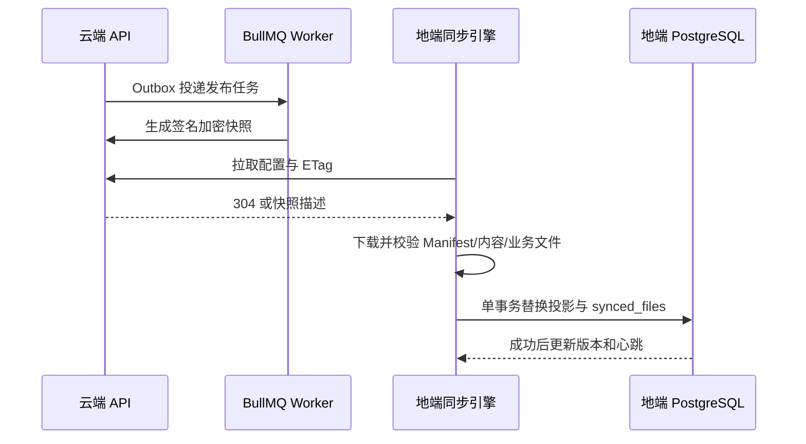

# Sentinel 云地双模式运行与审计说明

## 运行链路

云端后台通过 API 完成租户、监测对象、数据源、录入审核和发布。发布任务进入 Outbox/BullMQ，由 scheduler、snapshot、io、maintenance 四类 Worker 执行。快照由云端签名加密，业务文件使用 SHA-256 内容寻址对象；地端按部署配置的周期（默认 1 小时）通过 API 检查配置和快照版本。版本未变化时返回 304；有新版本时依次校验身份、许可证、Manifest、哈希、签名、AES-GCM，再在单个数据库事务中替换投影。

## 权限边界

- Portal 数据接口必须具备 `portal:read`。
- 暗网证据预览、证据下载和原始资产报告必须具备 `evidence:download`；隐藏前端按钮不构成权限控制。
- 许可证激活和刷新必须登录并具备 `edge:license`，`edge:admin` 通过角色权限集合获得同等能力。
- 许可证失效时仍允许 `/api/auth/login`、`/api/auth/me`、`/api/license/status` 和持有许可证权限的激活/刷新请求，普通业务 API 返回 `423 LICENSE_REQUIRED`。
- 公共 `/health` 只返回 `{ ok, service }`。数据库、Worker、租户、部署、同步和许可证详情通过受保护的管理接口读取。

## 数据生命周期

云端运行数据默认位于 `.runtime/cloud-data`，地端默认位于 `.runtime/edge-data`，可分别由 `SENTINEL_DATA_DIR` 和 `EDGE_DATA_DIR` 覆盖。现有 `apps/*/data` 不会被自动移动或删除。

地端业务文件位于 `files/objects/<sha256>/content`，相同 SHA-256 只保存一个对象，`synced_files.local_path` 可直接读取。下载使用临时目录，大小和哈希校验通过后原子改名；数据库事务失败时清理本次新建对象和快照目录，上一成功版本保持不变。

Edge Python Worker 在同步成功后按 `EDGE_SNAPSHOT_RETENTION_VERSIONS` 自动清理旧快照归档，默认保留 2 个版本。也可在 `sentinel-edge` 中执行 `npm run edge:snapshots:cleanup` 预览清单，确认后追加 `-- --apply`；清理不会触碰当前业务数据库中的投影数据。

## 故障处理

1. 许可证过期：使用本地管理员账号登录 `/edge-admin/login`，在许可证页激活或刷新；普通 Portal 用户不能修改许可证。
2. 同步失败：检查地端同步状态和最近错误，确认云端 OpenAPI Key、时间和网络；失败不会替换当前快照。
3. 数据库失败：恢复 PostgreSQL 后重新执行同步；临时文件和本次新对象会在失败路径清理。
4. 哈希或签名失败：保留上一成功版本，禁止手工绕过校验；检查云端快照发布和传输日志。

## 回归检查

已覆盖静态检查、类型检查、生产构建、依赖循环、单元/集成测试、云地 E2E、npm audit、Compose 配置校验，以及 Chromium 桌面 `1440x900` 和移动端 `390x844` 的云端后台、地端 Portal、权限边界、查询筛选、详情和管理页面。浏览器回归要求控制台无错误，并验证无数据、无权限、会话过期、许可证失效和同步失败状态。
